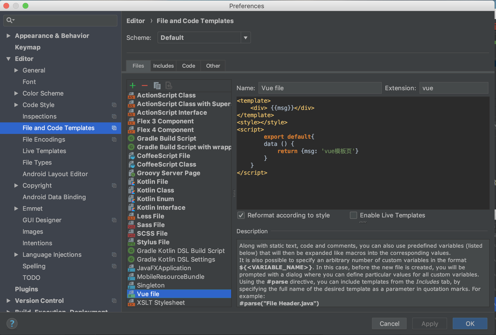
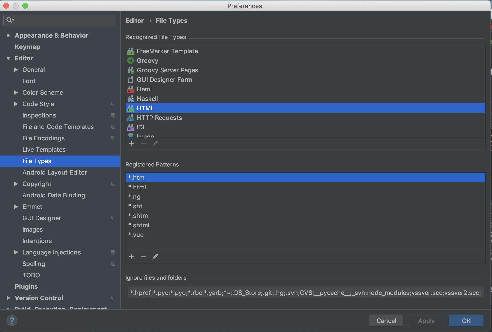

#项目简介

>整体概况

本次实验课，我们组HIS东软云医院采用了VUE-CLI与SpringBoot前后端分离模式进行开发。

实现了需求文档中所有的需求，从医生进行排班
，生成排班规则，到患者到医院进行挂号，检测，检查，买药，退药，退费等基础功能，以及打印发票，冲红发票，重打发票和医院
部门工作量统计，医院医生工作量统计等功能。

此外为了方便患者使用，我们开发了微信小程序的客户端，到目前为止，小程序客户端可以
实现增加病人信息以及在线挂号等功能。

>项目地址

    https://github.com/Jesse-HXY/hospital_front.git
    https://github.com/Jesse-HXY/hospital_back.git
    
>开发工具

    1)  IntelliJ IDEA
    2)  Navicat Premium 8
    3)  Mysql 5.5.56 或8.0.15 (小组成员使用版本不同无区别)
    4)  微信开发者工具
    
>项目前端

前端：

    1) VUE-CLI
    2) Element UI
    3) Cookie 缓存
    4) node.js

>项目后端

后端：

    1) JDK 1.8
    2) SpringBoot 框架
    3) MyBatis 持久层框架
    4) MySQL 数据库
    5) jUnit 单元测试
    6) Maven 开源项目管理工具
    7) poi 包用于读取 Excel 文件
    8) json-lib 用于封装 JSONObject 对象

#安装部署指南

##前端环境搭建

>VUE.js 与 Node.js 与 cnpm的下载以及配置

首先从IntelliJ IDEA中导入本项目前端部分代码再进行以下配置

Node.js 安装包及源码下载地址为：https://nodejs.org/en/download/

cnpm是淘宝镜像，下载一些jar包以及vue来说比npm稳定，速度快，该项目基于的是
vue 3.0以上的版本（3.7.0）

    安装vue-cli:   npm install -g @vue/cli
   
    安装cnpm:      npm install -g cnpm --registry=https://registry.npm.taobao.org
    
    cnpm安装vue-cli: cnpm install cnpm -g
    
如果安装成功我们可以在终端输入一下命令查看安装版本

    npm -v           npm安装版本
    
    cnpm -v          cnpm安装版本
    
    vue --version    vue安装版本
    
>将VUE-CLI前端部署到IntelliJ IDEA编译器
   
   首先我们需要配置一下IntelliJ IDEA编译器的环境，在设置中的File Types手动
   取消对node_modules的index检查，以防node_modules过大导致死机
   
   
   
   下面在IntelliJ IDEA中下载Node.js 与 VUE.js
   
   首先打开设置，在Plugins中找到并打开Browse Repositories，搜索Node.js
   与VUE.js下载并重新启动IntelliJ IDEA
   
   
   
   接着在File and Code Templates中新增文件类型 .vue 并初始化其模板
   
   
   
   在File Types中选择HTML文件在其中添加*.vue，这样可以在IntelliJ IDEA中
   创建vue的文件了
   
   
   
   我们打开其自带的Terminal，跳转到该项目的目录下，安装node_modules
        
       cnpm install
       
    
>配置npm，使vue项目在IntelliJ IDEA中启动

   完成之前vue与node在IntelliJ IDEA上的部署，接下来打开Configuration，选择npm
   并配置其属性，如图所示：
   
   
   
   完成之后就可以运行vue-cli，接下来只要在后端搭建SpringBoot就可以前后端相连
   
   此外我们向项目添加了Cookie技术，下载pdf功能，还有使用框架Element UI，一些包需要我们单独下载，一下命令
   可以帮助我们使用Cookie，下载pdf和使用Element UI
   
       npm install vue-cookies --save
       
       cnpm install --save html2canvas
       
       cnpm install jspdf --save
       
       npm i element-ui -S

   关于微信小程序，环境搭建比较简单，需要注意就是跨域问题，我们只需要勾选红色框的内容即可解决
   然后就可以将小程序与SpringBoot的后端连接实现其功能。另外一个问题便是域名问题，如果想在手机
   上进行真机操作需要设置域名，我们小组已经买了域名准备在接下来的工作中将小程序部署到上面实现真正的真机操作。
   
  
   

##后端环境搭建

>项目Maven依赖导入
  
    从 IntelliJ IDEA 中导入本项目后端部分源代码, 点击pom.xml文件，导入项目所需的Maven依赖。
   
>修改数据库密码

    从源码中拿到 SQL 代码并导入数据库。
    
>修改数据库密码
  
    打开 application.properties 文件并修改数据库密码。
    
>运行项目

    运行 HospitalBackApplication 中的 main 函数即可。
